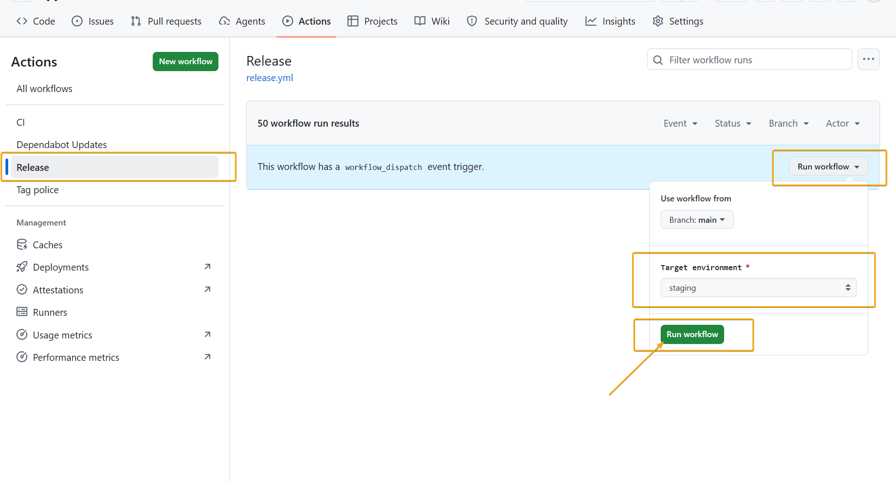
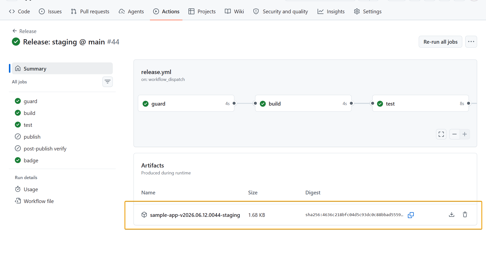

# How to release

A click-by-click guide for releasing this project. No prior GitHub Actions experience
needed. If a term is unfamiliar, the [README](../README.md) explains the moving parts.

> 📸 Screenshots are placeholders for now — drop the real images into `docs/img/`
> using the file names given in each placeholder.

## The 30-second version

This is a monorepo with two independently-released apps: **desktop** and **browser**.
Every release run picks **one app** and **one environment**, so the apps ship separately.

| I want to... | Do this |
|---|---|
| test an app's release candidate | run the **Release** workflow with **app** = desktop/browser, **environment** = staging |
| ship an app to users | run the **Release** workflow with that **app** + **environment** = production, then a reviewer approves |
| fix one app's production while `main` has unreleased work | make a `hotfix/*` branch from that app's last production tag (`desktop-v…`/`browser-v…`), then release **from that branch** |

Releases are always triggered from the `main` branch (or a `hotfix/*` branch); the
workflow refuses anything else. Version numbers are generated automatically — you never
type one.

---

## Release to staging

Staging is safe to run anytime: it produces a downloadable build artifact, no tag, no
public release, and needs no approval.

### In the browser

1. Open the repository on github.com and click the **Actions** tab (top of the page).
   

2. In the **left sidebar**, under "All workflows", click **Release**.

3. On the right side, click the **Run workflow** dropdown button. In the panel that
   opens: leave **Branch: main** as is, set **App to release** to **desktop** (or
   **browser**), set **Target environment** to **staging**, and click the green
   **Run workflow** button.

4. A new run named **"Release: desktop staging @ main"** appears in the list after a few
   seconds (refresh if needed). Click it and watch the jobs turn green:
   `guard` → `build` → `test`. (`publish` and `post-publish verify` stay skipped —
   they are production-only.)

5. Your build is at the **bottom of the run page**, in the **Artifacts** section, named
   after its app + version — e.g. `desktop-v2026.06.14.0045-staging` (names are unique per
   app+run and sort chronologically in your Downloads folder). Click it to download a ZIP
   containing the build and its checksum. It is kept for 30 days.
   

### From the terminal

```sh
gh workflow run release.yml --ref main -f app=desktop -f environment=staging
gh run watch   # then pick the newest run, or just watch it in the browser
```

---

## Release to production

Production does everything staging does, **plus**: a reviewer must approve, and on
success a Git tag and a public [GitHub Release](https://github.com/andrmarin/poc_release_pipeline/releases)
with the ZIP + `.sha256` are created — fully automatically after the approval.

1. Trigger exactly like staging (steps 1–3 above): pick the **app**, but set **Target
   environment** to **production**.

2. The run starts and then **pauses** — the `build` job shows "Waiting for review".
   This is the safety gate. A yellow banner appears at the top of the run page.
   (No pause? The repo was bootstrapped with `setup-github.sh --no-approval`, which
   disables the gate — runs go straight through. Skip to step 4.)

   > 📸 **Screenshot placeholder** — *run page with the yellow "This workflow is awaiting approval" banner.*
   > <!--  -->

3. **The approver** (anyone configured as a reviewer on that app's production environment
   — by default not the person who started the run) clicks **Review deployments** in that
   banner, ticks the **`<app>-production`** checkbox, optionally leaves a comment, and
   clicks **Approve and deploy**.

   > 📸 **Screenshot placeholder** — *the "Review pending deployments" dialog with production ticked and the Approve and deploy button.*
   > <!--  -->

4. From here, **no more clicks** — watch the jobs finish:
   `build` → `test` → `publish` → `post-publish verify`. The publish job creates a
   draft release, verifies both files made it, then publishes; the last job downloads
   the *published* release and verifies it end to end.

5. Find the result on the **Releases page** (repository front page → "Releases" in the
   right sidebar, or that app's *latest* badge in the README). The new release —
   e.g. `desktop-v2026.06.14.0045` — has two assets: the ZIP and its `.sha256` checksum.
   (The global **Latest** marker points at the most recent release across *both* apps; the
   per-app "latest" badge always shows that specific app's newest version.)

   > 📸 **Screenshot placeholder** — *Releases page with the new version at the top, marked Latest, two assets expanded.*
   > <!--  -->

> **Note:** the release builds the commit `main` pointed at when the run was **dispatched**.
> PRs merged while the run waits for approval are *not* included — dispatch a fresh run if you
> want them.

> **Note:** the duration shown in the Actions runs list is wall-clock time **including** the
> wait for approval (GitHub cannot exclude it). The run's **Summary** page shows a
> "Pipeline duration" table with the actual execution time.

### From the terminal

```sh
gh workflow run release.yml --ref main -f app=desktop -f environment=production
# approval still happens in the browser (step 2-3 above)
gh release list   # shows the new <app>-v... release when done
```

---

## Hotfix release

Use this when one app's production is broken but `main` already contains unreleased
features you do **not** want to ship yet. (The fix targets a single app.)

1. Find that app's **last production tag** on the Releases page — e.g. `desktop-v2026.06.14.0045`.
2. Branch **from that tag** — not from `main`:

   ```sh
   git fetch --tags
   git switch -c hotfix/fix-crash desktop-v2026.06.14.0045
   ```

3. Make the fix, push the branch, and open a PR into `main`. This PR gets the one and
   only code review.
4. After the PR is approved — but **before merging it** (merging auto-deletes the
   branch, and a deleted branch cannot be dispatched) — run the **Release** workflow:
   in the **Run workflow** panel select **your hotfix branch** instead of `main`, the
   **app** you are fixing, and environment **production**. Approval works the same as
   above. Heads-up: the run executes the pipeline *as it exists on your hotfix branch*,
   i.e. as of the tag you branched from.

   > 📸 **Screenshot placeholder** — *Run workflow panel with branch `hotfix/fix-crash` selected and environment `production`.*
   > <!--  -->

5. **Merge the hotfix PR into `main`** after the release. This is required: the next
   regular production release **fails on purpose** if a released hotfix was never
   merged back (so the fix can't silently disappear). Squash-merging is fine — the
   guard recognizes the merged PR.

Optional rehearsal: dispatch a **staging** release from the hotfix branch first.

---

## How do I know a release is good?

- All jobs in the run are green — especially **post-publish verify**, which downloads
  the actual published file and re-checks it.
- On the release, the ZIP contains a `build.info` stating the `app`,
  `environment=production`, the version, the commit, and a link back to the CI run.
- Verify a downloaded ZIP yourself anytime (pass the expected app as the last argument):

  ```sh
  gh release download desktop-v2026.06.14.0045 --dir dl   # into an empty folder
  bash scripts/verify.sh dl/desktop-*.zip production desktop
  ```

## Troubleshooting

| What you see | Why | What to do |
|---|---|---|
| Annotation: *"Simulated failure — SIM_FAIL_UPLOAD drill"* | someone armed the failure drill | `gh variable set SIM_FAIL_UPLOAD --body false`, re-run ([README](../README.md#simulating-failures-negative-path-drills)) |
| `guard` fails: *"must be dispatched from 'main' or a 'hotfix/*' branch"* | workflow was run from some other branch | re-run, selecting `main` (or your `hotfix/*` branch) in the Run workflow panel |
| `guard` fails: *"SIM_FAIL_UPLOAD is enabled"* on production | drill left armed; production refuses to run with simulations on | disarm (see first row), re-run |
| `build` fails: *"Latest \<app\> production tag ... is not an ancestor of main"* | that app had a hotfix released but its PR never merged into `main` | merge the hotfix PR, then re-run |
| `publish` fails: *"Tag ... already exists"* | a version collision from a re-run | dispatch a **new** run (fresh run number) instead of re-running |
| `build` fails: *"Computed version ... is not newer than \<app\>'s latest release"* | you re-ran an old failed run; its frozen run number now computes an outdated version | dispatch a **new** run from the Run workflow panel instead of re-running |
| Run stuck on *"Waiting for review"* | nobody approved the production gate | an eligible reviewer must click Review deployments → Approve; the person who dispatched may not be allowed to approve themselves |
